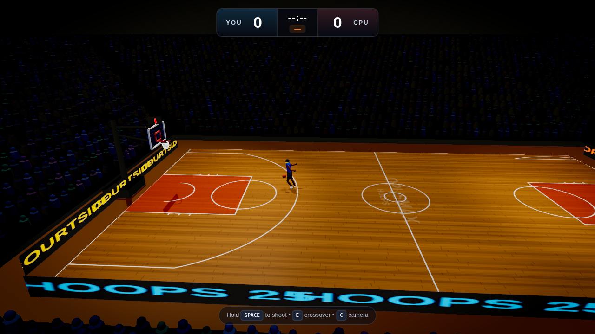
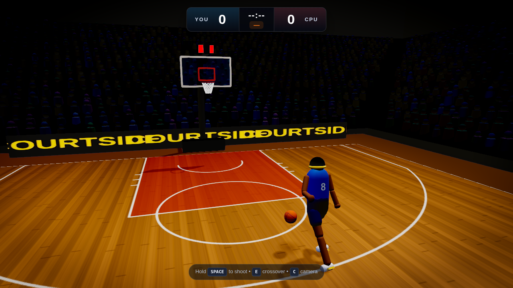
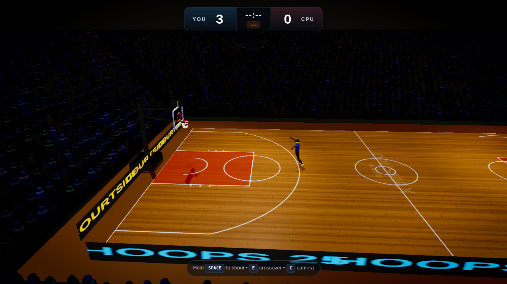

# 🏀 OpusMax Hoops — 3D NBA-Style Basketball

A realistic 3D basketball game that runs entirely in the browser. Built from
scratch with **Three.js** and a custom physics + animation stack — no game
engine, no external art assets. Everything (the arena, the crowd, the players,
the ball, the sound) is generated procedurally at load time.



|  |  |
| --- | --- |
|  |  |

## ✨ Features

- **Regulation arena** — a full 94′ × 50′ NBA court with accurate markings
  (three-point arc, key, restricted area, free-throw circles), glossy hardwood,
  two full basket assemblies (glass backboard, breakaway rim, animated net,
  padded stanchion), a live crowd of **~3,000 instanced spectators**, glowing
  courtside LED boards, a spinning jumbotron, and a truss ceiling.
- **Cinematic rendering** — physically based materials, real-time shadows,
  ACES filmic tone mapping, bloom, SMAA anti-aliasing, and a subtle color grade
  with vignette for that broadcast look.
- **Custom ball physics** — gravity, air drag, and analytic collisions against
  the floor, both rims, and both backboards, with true swish / rim-in / brick
  outcomes and a springy animated net.
- **Skill-based shooting** — a charge-and-release **shot meter** with a "green"
  window. A ballistic solver aims each shot at the rim; your release timing,
  distance, movement, and any defender contest perturb the aim so the physics
  decides whether it drops.
- **Articulated players** — humanoid rigs animated procedurally (idle, run,
  dribble, shoot, defend) with no baked animation files.
- **Three cameras** — broadcast (sideline), follow (over-the-shoulder), and a
  low action cam. Press **C** to cycle.
- **Procedural audio** — bounces, rim clanks, backboard thuds, swishes, shoe
  squeaks, the ref's whistle, the buzzer, and a reactive crowd bed — all
  synthesized live with the Web Audio API.
- **Three game modes:**
  - **Freestyle** — no clock, just you and the rim.
  - **60-Second Challenge** — score as much as you can before the buzzer.
  - **1-on-1 vs CPU** — a defender contests your shots; first to 11 wins.

## 🎮 Controls

| Input | Action |
| --- | --- |
| **W / A / S / D** (or arrows) | Move (camera-relative) |
| **Shift** | Sprint |
| **Space** (hold, then release) | Charge and shoot — release in the green window |
| **E** | Crossover / change dribbling hand |
| **C** | Switch camera |
| **Mouse** | Look around (follow / action cameras) |

**Shooting tip:** hold Space to fill the meter, then release when the marker is
in the green zone near the top. Perfect timing from in range is a bucket;
mistimed or contested shots fall short or rattle out.

## 🚀 Running it

Requires Node 18+.

```bash
npm install
npm run dev      # start the dev server, then open the printed URL
```

To make a production build:

```bash
npm run build    # outputs to dist/
npm run preview  # serve the built game
```

## 🧱 Architecture

```
src/
├── main.js               # bootstrap: loading screen, menu, RAF loop
├── config.js             # NBA dimensions + all physics / feel tuning
├── core/
│   ├── Game.js           # orchestrator: builds the world, runs the loop, wires events
│   ├── Renderer.js       # WebGL renderer + post-processing (bloom, SMAA, grade)
│   ├── Input.js          # keyboard / mouse with edge detection + pointer lock
│   └── AudioEngine.js    # Web Audio synthesis (SFX + crowd)
├── world/
│   ├── Court.js          # baked hardwood + line-marking texture
│   ├── Hoop.js           # backboard, rim, animated net, stanchion
│   ├── Arena.js          # decks, instanced crowd, LED boards, jumbotron, ceiling
│   └── Lighting.js       # key/fill/spot arena lighting rig
├── entities/
│   ├── Ball.js           # textured basketball + spin + contact shadow
│   ├── Player.js         # articulated rig + procedural animation states
│   └── Defender.js       # CPU 1-on-1 defender AI
├── systems/
│   ├── Physics.js        # ball integration + floor/rim/backboard collisions + scoring
│   ├── ShotSystem.js     # ballistic solve + timing/distance/contest error model
│   ├── CameraSystem.js   # broadcast / follow / action cameras
│   ├── PlayerController.js# movement, dribbling, charge→release shot flow
│   └── GameState.js      # score, clocks, streaks, possession
└── ui/
    ├── HUD.js            # scoreboard, shot meter, announcements
    └── styles.css        # menu + HUD styling
```

## 🛠️ Tech

- [Three.js](https://threejs.org/) r170 for rendering
- Vite for dev server and bundling
- Web Audio API for all sound
- Zero image/model/audio asset files — everything is generated in code

## 📄 License

MIT — do whatever you like with it.
